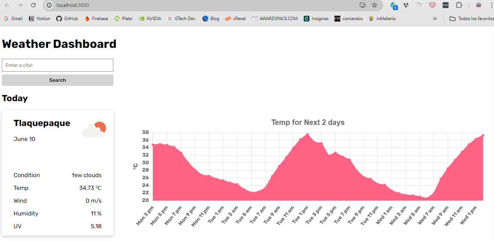
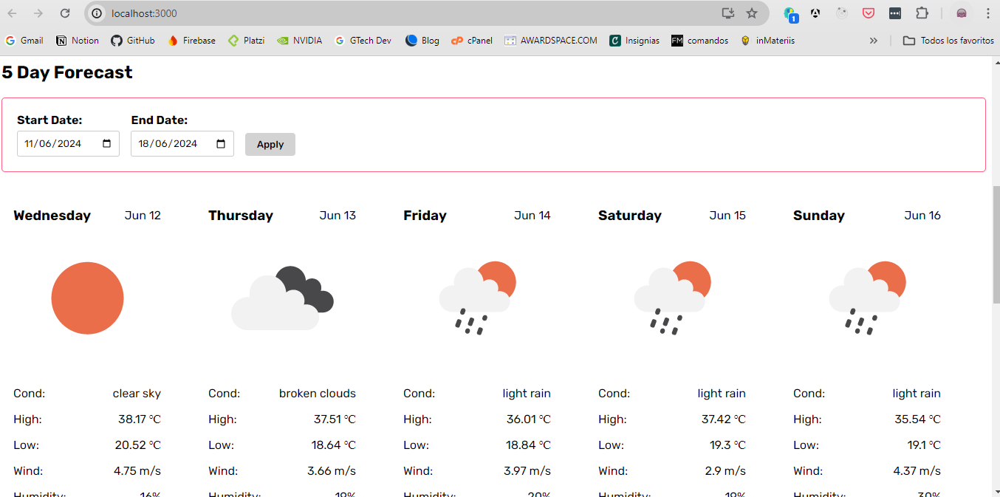
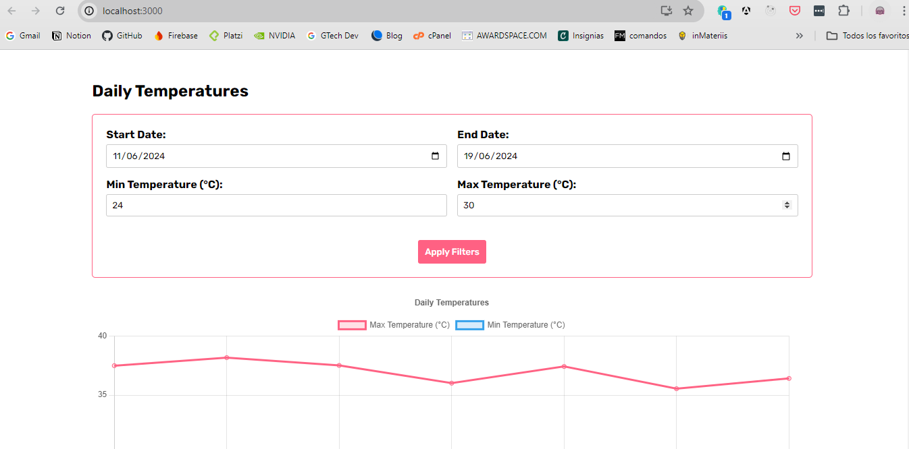
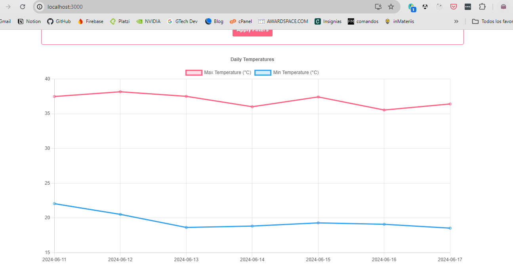

# Documentation

## Introduction

This project is an interactive dashboard that displays current weather information and forecasts for the next 5 days. It uses the OpenWeatherMap API to fetch real-time weather data. The application is built using React and various complementary libraries such as Chart.js and react-datepicker to display charts and select dates, respectively.

## Aproach taken

The application is divided into modular components to enhance code readability and maintenance. A user-centered approach has been adopted, ensuring that the interface is user-friendly and accessible to all users.

## Instalation

To install the necessary dependencies for this project, you can run the following command in the terminal at the root of your project:

`npm install`

This will install all the dependencies specified in the package.json file, including the necessary libraries like React, Chart.js, and react-datepicker, among others. Once the installation is complete, you'll be ready to run your application.

### Commands of necessary installations.

In any case, I share with you the commands that I use for the necessary installations.

`npm install react-chartjs-2 chart.js`

`npm install dayjs`

`npm install styled-components`

`npm install react-datepicker`

`npm install --save-dev jest @testing-library/react @testing-library/jest-dom --legacy-peer-deps`

## To run the project in local

In the project directory, you can run:

### `npm start`

Runs the app in the development mode.\
Open [http://localhost:3000](http://localhost:3000) to view it in your browser.

The page will reload when you make changes.\
You may also see any lint errors in the console.

## To run the Jest tests

I included two unit tests made with jest, one in App.test.js and the other in src/DateRangerPicker.text.js, which you can run with the following command on your local.

### `npm test`

## How works

First you must find a city

Then you can filter the following days that you want to know the weather

You can also filter the lowest and highest temperatures of certain dates

# Other commands

### `npm run build`

Builds the app for production to the `build` folder.\
It correctly bundles React in production mode and optimizes the build for the best performance.

The build is minified and the filenames include the hashes.\
Your app is ready to be deployed!

See the section about [deployment](https://facebook.github.io/create-react-app/docs/deployment) for more information.

### `npm run eject`

**Note: this is a one-way operation. Once you `eject`, you can't go back!**

If you aren't satisfied with the build tool and configuration choices, you can `eject` at any time. This command will remove the single build dependency from your project.

Instead, it will copy all the configuration files and the transitive dependencies (webpack, Babel, ESLint, etc) right into your project so you have full control over them. All of the commands except `eject` will still work, but they will point to the copied scripts so you can tweak them. At this point you're on your own.

You don't have to ever use `eject`. The curated feature set is suitable for small and middle deployments, and you shouldn't feel obligated to use this feature. However we understand that this tool wouldn't be useful if you couldn't customize it when you are ready for it.

## Learn More

You can learn more in the [Create React App documentation](https://facebook.github.io/create-react-app/docs/getting-started).

To learn React, check out the [React documentation](https://reactjs.org/).

### Code Splitting

This section has moved here: [https://facebook.github.io/create-react-app/docs/code-splitting](https://facebook.github.io/create-react-app/docs/code-splitting)

### Analyzing the Bundle Size

This section has moved here: [https://facebook.github.io/create-react-app/docs/analyzing-the-bundle-size](https://facebook.github.io/create-react-app/docs/analyzing-the-bundle-size)

### Making a Progressive Web App

This section has moved here: [https://facebook.github.io/create-react-app/docs/making-a-progressive-web-app](https://facebook.github.io/create-react-app/docs/making-a-progressive-web-app)

### Advanced Configuration

This section has moved here: [https://facebook.github.io/create-react-app/docs/advanced-configuration](https://facebook.github.io/create-react-app/docs/advanced-configuration)

### Deployment

This section has moved here: [https://facebook.github.io/create-react-app/docs/deployment](https://facebook.github.io/create-react-app/docs/deployment)

### `npm run build` fails to minify

This section has moved here: [https://facebook.github.io/create-react-app/docs/troubleshooting#npm-run-build-fails-to-minify](https://facebook.github.io/create-react-app/docs/troubleshooting#npm-run-build-fails-to-minify)
